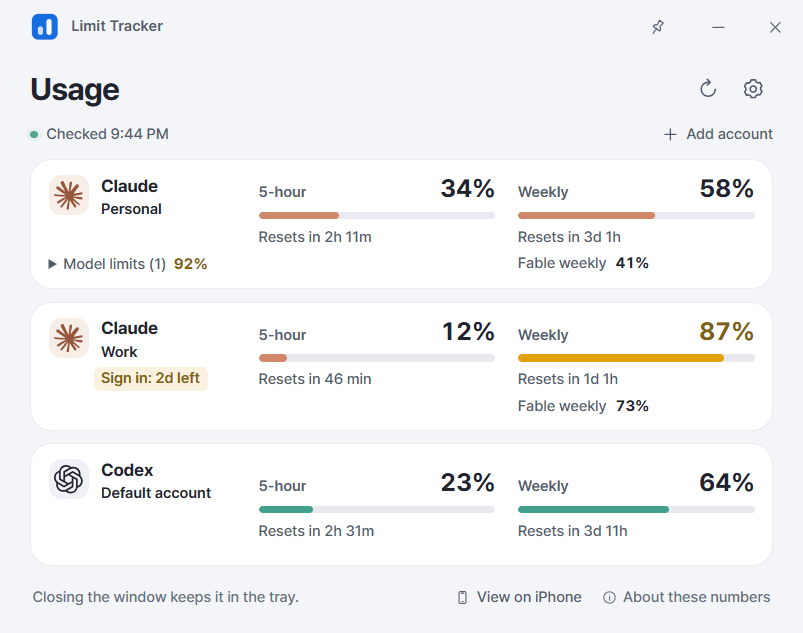

# Limit Tracker

Keep an eye on your AI usage limits from the Windows system tray.

**[Download for Windows](https://github.com/nowsummer/Limit-Tracker/releases/latest)** · [Release notes](https://github.com/nowsummer/Limit-Tracker/releases) · [Report an issue](https://github.com/nowsummer/Limit-Tracker/issues)

## Features

- Track Claude, Codex, and Gemini CLI usage across multiple accounts.
- See usage percentages and reset times in a compact dashboard and tray popup.
- Choose which accounts appear in the dashboard or tray, and drag to reorder them.
- Get usage and reset notifications, with automatic app updates.
- Switch between English and Korean, with light and dark themes.
- Optionally view usage on an iPhone on the same local network.

## Get started

1. Download the EXE from the latest release and open it. It installs for your Windows user and launches the app.
2. Add an account. Automatic tracking uses your own Claude Code, Codex, or Gemini CLI login; install the relevant CLI first. Manual tracking is also available.
3. Adjust tray icons, notifications, and language in Settings.

Share the same EXE with someone else; they connect their own accounts. Your account data is not included in the download.

## Good to know

- Windows x64 only. The installer is currently unsigned, so Windows may warn about or block it.
- Claude usage is shared with Claude Code. Codex usage is separate from ordinary ChatGPT chat limits.
- Automatic tracking contacts the relevant AI provider; app updates come from GitHub. Credentials stay in local login stores. Claude credentials are refreshed there when needed, and the provider may require you to sign in again.
- This is an independent project. Provider changes may affect tracking. The iPhone view requires the PC to stay online on the same private network.

Created by **Jaeha Lee**. For questions, bugs, or suggestions, use [GitHub Issues](https://github.com/nowsummer/Limit-Tracker/issues). Please leave out passwords and login tokens.

This repository hosts downloads, release notes, and support. Application source code is not published here.
